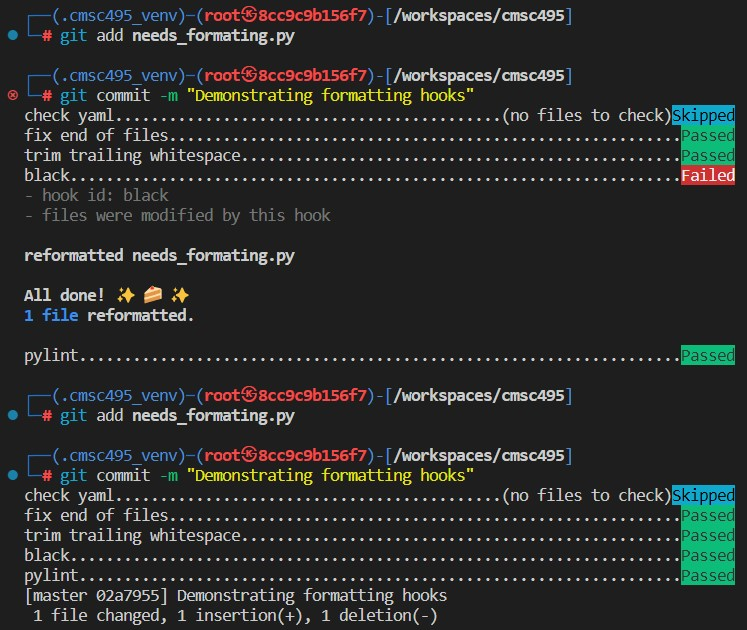

This project was contributed to by:

Paul Fitch - plftch9;
Joe Lustri - sustainablelobster;
Amaka Black - blacknnwa;

The goal of the program was to create a recipe recommendation system based on ingredients present in a user's home. The user submits a list of ingredients and the program finds reciepes that can be made with what is available.

## Developer System Requirements

- Some flavor of Linux
- Git
- Build tools
  - Debian-based distros (Ubuntu, Mint, etc.):
    `sudo apt install build-essential`
  - Fedora-based distros (RHEL, CentOS, etc.):
    `sudo yum groupinstall 'Development Tools'`
- Python 3.10 or greater (comes pre-installed on several modern distros)
  - Debian-based distros may need to install the `venv` module:
    `sudo apt install python3-venv`
- Python 3 development headers:
  - Debian-based distros: `sudo apt install python3-dev`
  - Fedora-based distros: `sudo yum install python3-devel`

## Getting Started with Development

### init

This project uses a Python
[virtual environment](https://docs.python.org/3/library/venv.html) to manage
dependencies. Additionally, [pre-commit hooks](https://pre-commit.com/)
are used to help ensure that all code conforms to the same standard. The
[`init`](./init) script facilitates the installation, maintenance, and
activation of these features.

**Always source the `init` script before doing any work in this repo and after
pulling changes:** `source ./init`

The first time you source `init` may take several minutes, as it will do
the following:

1. Create a Python virtual environment named `.cmsc495_venv`
2. Activate the virtual environment
3. Install the `pre-commit` Python package in the virtual environment
4. Install any Python dependencies listed in
   [`requirements.txt`](./requirements.txt) in the virtual environment
5. Install the pre-commit hooks defined in
   [`.pre-commit-config.yaml`](./.pre-commit-config.yaml)

Subsequent runs will simply activate the virtual environment and install any
new dependencies or hooks.

If you see the string `(.cmsc495_venv)` in your shell's prompt, this means that
the virtual environment is active (see the example screenshot below).


When you're done working on the repo, run the `deactivate` command to return
your shell to its original state.

### Running the App

To run the `fridge2table` app in debug mode, run the following command:

```
flask --app fridge2table run --debug
```

### Packaging the Project

To package the project into a wheel file for distribution, run the following command:

```
python -m build --wheel
```

This will create a directory named `dist` containing a `.whl` file of the project.

### Project Layout

The project's source tree follows the layout described in Flask's
["Project Layout"](https://flask.palletsprojects.com/en/3.0.x/tutorial/layout/)
tutorial. Project source files are located in the [`fridge2table`](fridge2table/)
directory.

### Git Workflow

See [this article](https://www.atlassian.com/git/tutorials/comparing-workflows/feature-branch-workflow) by Atlassian for a detailed walkthrough of the "git
feature branch" workflow.

#### Creating a New Feature Branch

Our repo has a single `main` branch that contains the sum of our completed,
peer-reviewed work. `main` also serves as the starting point for new feature
branches. Before you begin work on a new feature, make sure to branch off from
the latest version of `main` by running the following commands (replacing
"NAME_OF_FEATURE" with a short, descriptive feature name):

```
git checkout main
git fetch origin
git reset --hard origin/main
git checkout -b NAME_OF_FEATURE
```

**Always create a new branch. Never work directly on main.**

#### Committing Changes

As you work on your feature, make commits frequently to save your progress:

```bash
git status # see your changes
git add <new or modified file>
git commit -m "<short messsage describing changes>"
```

Your code must pass all pre-commit hooks before the commit is finalized. Most of
our hooks simply check for formatting and make fixes automatically (e.g. `black`
for Python formatting). If your code fails one of these hooks, simply rerun your
last `git add` and `git commit` commands (see the example screenshot below).



However, if your code fails one of our linting hooks (e.g. `pylint`), you will
need to make changes to your code to address the warnings. In the example
screenshot below, the commit failed the `pylint` hook because the Python file
being added was missing a module
[docstring](https://peps.python.org/pep-0257/#what-is-a-docstring).


#### Pushing to Remote

When you're done for the day, make sure to push your local changes to the remote
repo (replace "NAME_OF_FEATURE" with the actual name of your feature branch):

```
git push -u origin NAME_OF_FEATURE
```

This ensures your work is backed up, and is required in order for the team to
review your work.

#### Creating Pull Requests

When your work is ready for review,
[create a pull request](https://docs.github.com/en/pull-requests/collaborating-with-pull-requests/proposing-changes-to-your-work-with-pull-requests/creating-a-pull-request#creating-the-pull-request)
on GitHub to notify the team. Once approved, your branch is merged into `main`
and the cycle begins anew.
